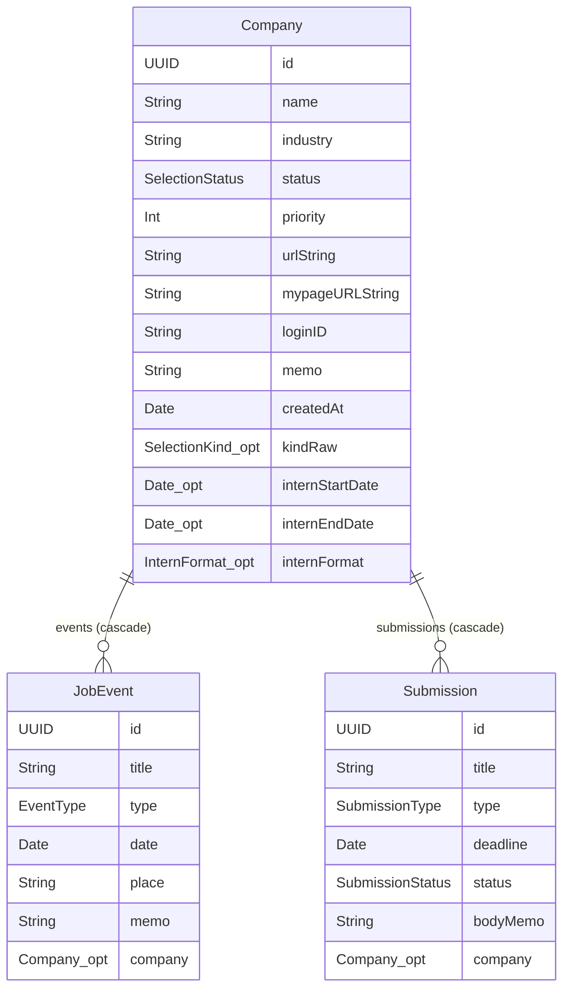

# データモデル（論理スキーマ）

`JobHuntManager/Models/` に定義されている SwiftData の `@Model` 3種と、それらが使う enum の一覧。
実際にディスク上でどう表現されるかは [persistence.md](persistence.md)、各画面がどう読み書きするかは [data-access.md](data-access.md) を参照。

**最終更新: 2026-08-26（マイページ情報 / インターン実施方法の追加まで反映）**

---

## 全体像



エンティティは3つだけで、`Company` を親とする1対多が2本。企業をまたぐ関連や、予定と提出物の間の関連は存在しない。

---

## Company（企業）

`JobHuntManager/Models/Company.swift`

| プロパティ | 型 | 既定値 | 説明 |
|---|---|---|---|
| `id` | `UUID` | `UUID()` | `Identifiable` の識別子。検索・一意制約には使っていない |
| `name` | `String` | `""` | 企業名。必須入力だが型上は空文字を許す |
| `industry` | `String` | `""` | 業界。任意 |
| `status` | `SelectionStatus` | `.interested` | 選考ステータス |
| `priority` | `Int` | `0` | 志望度 0〜3。UI 上は `PriorityDotsView` の3段階＋未設定 |
| `urlString` | `String` | `""` | 採用ページの URL。`URL` 型ではなく文字列で保持 |
| `mypageURLString` | `String` | `""` | 応募者マイページの URL。`urlString` とは用途が違うので別フィールド |
| `loginID` | `String` | `""` | マイページのログインID。**平文で保存する**（後述） |
| `memo` | `String` | `""` | 自由メモ |
| `createdAt` | `Date` | `Date()` | 登録日時。企業一覧の既定ソートキー |
| `kindRaw` | `SelectionKind?` | `nil` | 選考区分の**保存用**。直接触らない（後述） |
| `internStartDate` | `Date?` | `nil` | インターン実施の開始日 |
| `internEndDate` | `Date?` | `nil` | インターン実施の終了日 |
| `internFormat` | `InternFormat?` | `nil` | インターンの実施方法。`nil` は未設定 |

### 派生プロパティ

| プロパティ | 型 | 内容 |
|---|---|---|
| `kind` | `SelectionKind` | `kindRaw ?? .fullTime`。読み書きは必ずこちら経由 |
| `internPeriodLabel` | `String?` | `"8/1〜8/5"` / 単日なら `"8/1"`。本選考・開始日未設定なら `nil` |

### `kindRaw` / `kind` の二段構え

非 Optional の enum プロパティを後から足すと、**既存インストールが起動直後にクラッシュする**（自動軽量マイグレーションは列を足すだけで既存行に既定値を書かないため、NULL を非 Optional の enum として読んで落ちる）。
そのため保存は Optional の `kindRaw`、参照は既定値を補う `kind` に分けている。詳細な再現手順と検証方法は [../model-migration.md](../model-migration.md)。

### 実施期間の扱い

- 実施期間と実施方法は `kind == .internship` のときだけ意味を持つ。`CompanyEditView.applyKind(to:)` が本選考へ戻した際にすべて `nil` に落とすので、**本選考の企業に実施期間・実施方法が残ることはない**。
- `internEndDate` が `nil` で `internStartDate` だけある場合は「1日開催」として扱う（`UpcomingTimeline` / `internPeriodLabel` の両方でこの解釈）。
- `Company.init` は `kind` も `internFormat` も受け取らない。イニシャライザだけで作った企業は `kindRaw == nil` すなわち本選考になる。
- `internFormat` は **Optional の enum なので `kindRaw` のような二段構えが要らない**。二段構えが必要なのは「後から足す**非** Optional の enum」だけで、`nil` を未設定として持てるならそのままでよい。

### マイページ情報の扱い

- `mypageURLString` と `urlString` は**別々の用途**（前者はログインする先、後者は調べる先）。片方だけ入力された状態が普通にあるので、詳細画面はどちらも空なら行ごと出さない。
- `loginID` は SwiftData のストアに**平文で保存される**。`memo` と同じ扱いで、Keychain には入れていない。**パスワードを持たせる場合はこの前提が変わる**ので、そのときは Keychain への退避を設計し直すこと。

---

## JobEvent（予定）

`JobHuntManager/Models/JobEvent.swift`

| プロパティ | 型 | 既定値 | 説明 |
|---|---|---|---|
| `id` | `UUID` | `UUID()` | `Identifiable` の識別子 |
| `title` | `String` | `""` | 予定名 |
| `type` | `EventType` | `.other` | 種別 |
| `date` | `Date` | `Date()` | 開始日時。**時刻まで持つ**（`DatePicker` は日付＋時刻） |
| `place` | `String` | `""` | 場所・URL。任意 |
| `memo` | `String` | `""` | 自由メモ |
| `company` | `Company?` | `nil` | 所属企業（`Company.events` の逆関係） |

終了時刻・所要時間は持たない。カレンダーやホームでは開始日時1点だけで並べている。

---

## Submission（提出物）

`JobHuntManager/Models/Submission.swift`

| プロパティ | 型 | 既定値 | 説明 |
|---|---|---|---|
| `id` | `UUID` | `UUID()` | `Identifiable` の識別子 |
| `title` | `String` | `""` | 提出物名 |
| `type` | `SubmissionType` | `.entrySheet` | 種別 |
| `deadline` | `Date` | `Date()` | 締切日時。**時刻まで持つ**が、判定は日単位（`startOfDay` 起点） |
| `status` | `SubmissionStatus` | `.notStarted` | 進捗 |
| `bodyMemo` | `String` | `""` | ES 本文の下書き置き場 |
| `company` | `Company?` | `nil` | 所属企業（`Company.submissions` の逆関係） |

### 派生プロパティ

| プロパティ | 型 | 内容 |
|---|---|---|
| `urgency` | `SubmissionUrgency` | 締切の緊急度。提出済 → `.done`、今日0:00より前 → `.overdue`、3日後0:00より前 → `.soon`、それ以外 → `.normal` |

`urgency` は**永続化されない導出値**で、締切タブのセクション分けとホームの「期限間近」カウントの両方がこれ1つに依存している。判定ロジックの詳細は [data-access.md](data-access.md#派生ロジック)。

---

## Enum 一覧

すべて `String` の `rawValue` を持つ `Codable` enum。**`rawValue` は表示ラベル兼永続化値**なので、値を変えると既存データが読めなくなる（[../model-migration.md](../model-migration.md) の罠2）。表示だけ変えたいときは `label` 側で吸収する。

### SelectionStatus（選考ステータス）— `Company.status`

| case | rawValue（＝保存値） | `label`（＝表示） | `sortOrder` |
|---|---|---|---|
| `interested` | `興味あり` | 同じ | 0 |
| `applied` | `エントリー` | 同じ | 1 |
| `esSubmitted` | `ES提出` | 同じ | 2 |
| `writtenTest` | `筆記` | **テスト** | 3 |
| `interviewing` | `面接中` | **面接** | 4 |
| `offer` | `内定` | 同じ | 5 |
| `declined` | `見送り` | 同じ | 6 |

- `sortOrder` は一覧のフィルタチップやピッカーの並び順。**保存値ではない**ので自由に変えてよい。
- ステータスはインターンと本選考で共通の1系列で、**選考区分による言い換えはしない**。企業タブのフィルタチップが `label` を使う以上、他の場所だけ別ラベルにするとフィルタ名と表示が食い違うため。
- `indicatorColor` は `Theme.swift` のセマンティックカラーを返す。

### SelectionKind（選考区分）— `Company.kindRaw`

| case | rawValue |
|---|---|
| `fullTime` | `本選考` |
| `internship` | `インターン` |

### InternFormat（インターンの実施方法）— `Company.internFormat`

| case | rawValue |
|---|---|
| `online` | `オンライン` |
| `inPerson` | `対面` |
| `hybrid` | `ハイブリッド` |

`nil` は未設定。編集フォームのピッカーにも「未設定」の選択肢がある。

### EventType（予定の種別）— `JobEvent.type`

| case | rawValue |
|---|---|
| `briefing` | `説明会` |
| `interview` | `面接` |
| `test` | `テスト` |
| `obVisit` | `OB訪問` |
| `other` | `その他` |

### SubmissionType（提出物の種別）— `Submission.type`

| case | rawValue |
|---|---|
| `entrySheet` | `ES` |
| `resume` | `履歴書` |
| `other` | `その他` |

### SubmissionStatus（提出物の進捗）— `Submission.status`

| case | rawValue |
|---|---|
| `notStarted` | `未着手` |
| `inProgress` | `作成中` |
| `submitted` | `提出済` |

### SubmissionUrgency（緊急度）

`done` / `overdue` / `soon` / `normal` の4値。**永続化されない**（`Submission.urgency` の戻り値専用）ので、`String` の rawValue も持たない。ケースの追加・改名は自由。

---

## リレーション

```swift
// Company 側にだけ @Relationship を書き、子側は素の Optional 参照
@Relationship(deleteRule: .cascade, inverse: \JobEvent.company)
var events: [JobEvent] = []

@Relationship(deleteRule: .cascade, inverse: \Submission.company)
var submissions: [Submission] = []
```

| 項目 | 内容 |
|---|---|
| 多重度 | `Company` 1 : `JobEvent` 多 / `Company` 1 : `Submission` 多 |
| 削除規則 | `.cascade`（企業を消すと予定・提出物も消える）。`RelationshipTests.testDeletingCompanyCascadesToChildren` で固定 |
| 逆関係 | 子の `company` プロパティ。`inverse:` は親側にだけ書く |
| 子から見た所属 | `Company?` — **企業に紐づかない予定・提出物を型上は作れる**。UI 上は企業詳細からしか追加できないため実際には発生しないが、`if let company` のガードが各所にある |
| 順序 | **保証なし**。`events` / `submissions` の配列順は不定なので、表示側で必ず明示的にソートする |

### 逆関係を手で append しない

```swift
// ✅ これだけでよい
context.insert(JobEvent(title: "二次面接", date: d, company: company))

// ❌ 追加でこれをやると二重登録になる
company.events.append(event)
```

イニシャライザで `company:` を渡して `insert` するだけで両方向の関係が張られる。`RelationshipTests` が件数1件を検証しているので、壊すとテストが落ちる。

---

## モデル全体にかかる制約

| 制約 | 理由 |
|---|---|
| 全プロパティに既定値がある | 自動軽量マイグレーションの安全性と、CloudKit ミラーリングの要件（[../cloudkit.md](../cloudkit.md)）を同時に満たす |
| `@Attribute(.unique)` を使わない | CloudKit が一意制約をサポートしないため。将来の同期導入の余地を潰さない |
| リレーションはすべて Optional ＋ inverse あり | 同上（CloudKit 要件） |
| `deleteRule` は `.cascade` のみ（`.deny` 不可） | 同上（CloudKit 要件） |
| 後から足す非 Optional の enum は禁止 | 既存インストールがクラッシュする。Optional の `*Raw` ＋ アクセサに分ける |

---

## 既知の弱点

- **`Company.id` の役割が曖昧** — `Identifiable` 用に生成しているだけで、一意制約もなければ検索キーにもなっていない。同じ企業を2回登録しても別レコードになる。CloudKit を入れると端末間の重複マージで問題になる。
- **選考の履歴が残らない** — `status` は現在値の1フィールドのみ。「いつ面接に進んだか」「なぜ見送りになったか」は記録できない。
- **予定に終了時刻がない** — `JobEvent` は開始日時1点だけ。
- **`VersionedSchema` がない** — スキーマ変更は自動軽量マイグレーション頼み。詳細と対処は [../model-migration.md](../model-migration.md)。
